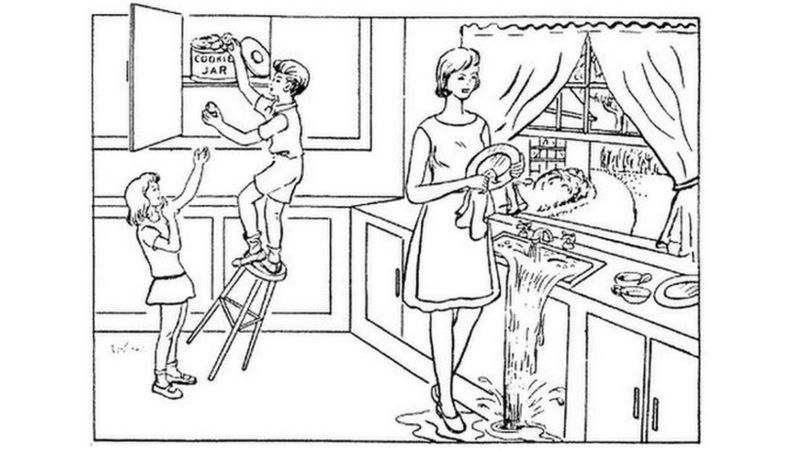

```{r setup, include=FALSE}
knitr::opts_chunk$set(echo = FALSE)
```


This post is an analysis of Analysis of *The AI that spots Alzheimer's from cookie drawingt*
[@2020AI]

_Source of the article_ : BBC News

_Word count_ : 607

_URL_ : https://www.bbc.com/news/technology-54538228  


## Summary 

The AI (artificial intelligence) can help to diagnose early the Alzheimer, about 7 years before the symptoms really appear. 
This method involves analysing the way people describe a scene that is drawn like the one above. Depending on how people express themselves for example if they change slightly their language, if they do grammar errors or change their tenses structures, we can diagnose whether people will suffer from Alzheimer.
This is really important for treatment, because more we diagnose it quickly, better the treatment and the person's comfort of life will be. 
But the actual diagnosis will always be taken by the doctor and the AI will never decide.


## Vocabulary: 

| Words from the text 	| Synonym / explanation in English 	| French translation |
|:-------------------:	|:--------------------------------:	|:----------------:	|
|samples|Small number or amount of sb/sth that is looked at, tested, examined,…. To find out what the rest is like|échantillons|
|excerpts|A short piece taken from a book, film, piece of music,...|extraits|
|acknowledged|To accept or admit that sth is true or exist|accuser réception|


## Analysis table about the study


#### *Researchers ?*
* UK's Alzheimer's Society
* Fiona Carragher, director of Research at the Alzheimer's Society
* IBM Research and pharmaceutical giant Pfizer
* Ajay Royyuru, IBM's vice-president of Healthcare Research

#### *Published in ? when (if mentioned) ?*
The Lancet eClinicalMedicine journal 
23th of October 2020


#### *General topic*
AI and Alzheimer


#### *Procedure/ what was examined* 
* Description of a scene, a picture 
* AI found changes in the language which indicate cognitive decline


#### *Conclusion / discovery* 
It’s a great thing to found out up to 7 years before developing the disease
The AI will not give the diagnosis but will help the doctor 


#### *Remaining questions*
/
